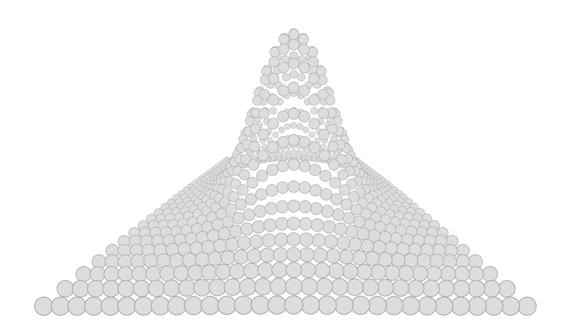
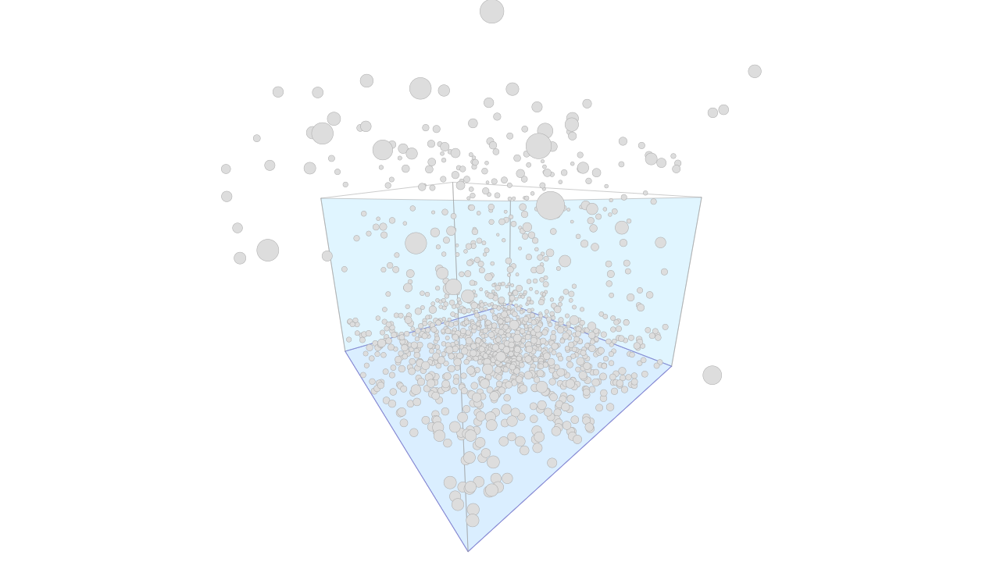
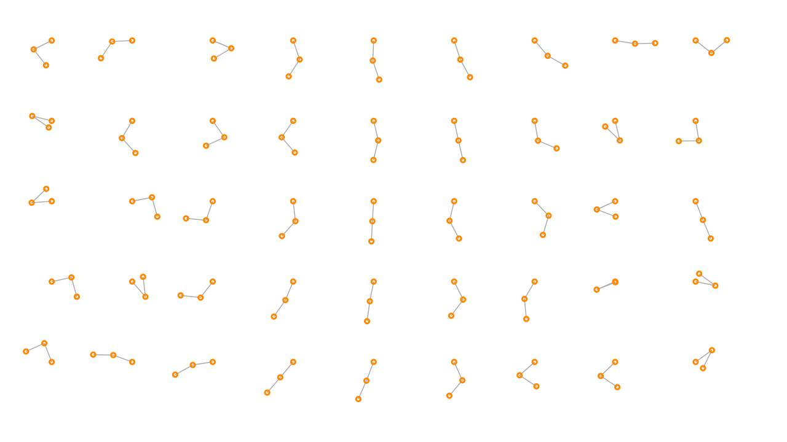
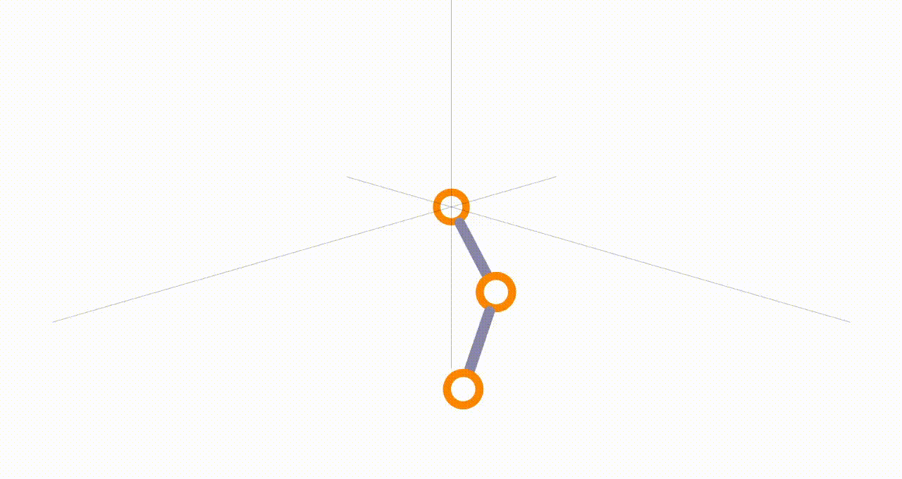

# ZetaSVG

## Synopsis

ZetaSVG – A reactive 3D engine for SVG elements. Define SVG elements (circles, paths, etc.) with X/Y/Z positions, and let ZetaSVG handle the rest.

## Installation & Running the App

1. Clone this
2. npm i
3. npm run start
4. Browser -> http://127.0.0.1:8080 -> dist

## Samples

https://greenhol.github.io/ZetaSVG/index.html

